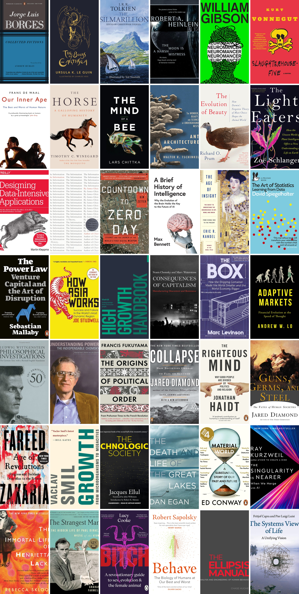

# Image Collage Creator

I wanted to create bookcover collages like this to share with my friends.
This Python script helps you create same beautiful collages from your images. It's simple to use and works with common image formats like JPG, PNG, and more.

## Requirements

- Python 3 installed on your computer.
- `Pillow` library (for image processing). The script will guide you to install it if needed.

## How to Use
1. **Prepare Your Images**
   Keep all images you want to make collage in a single new folder with nothing else

2. **Save the Script**  
   Save [this script](https://github.com/vizagite/collage_creator/blob/main/collage_gen.py?raw=true) and move it into the above folder of images. `ctrl+s` shortcut.

3. **Open a Terminal or Command Prompt**  
    In the same folder, you can open a terminal or command prompt window.
    or open command prompt and Navigate to the folder where containing `collage_gen.py`. use the commands like `cd` or `chdir` to navigate.

4. **Run the Script**  
   Use the following commands to create a collage:

   `python collage_gen.py` or `python collage_gen.py -c 7` to adjust columns

5. For more advanced use pass other options
    
    `python collage_gen.py --columns 3 --input-dir "my_images" --output "my_collage.jpg" --width 400 --height 600 --padding 15 --background "black"`

Enjoy creating your collages! 🎉

## Troubleshooting
- If you see an error about Pillow not being installed, type y when prompted to install it.
- Make sure your images are in the correct folder and have the right file extensions.